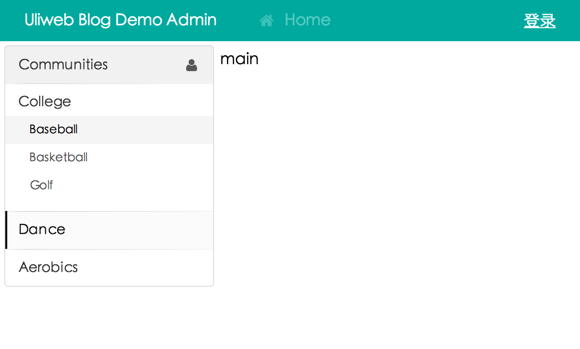

# 管理界面布局

## 介绍

一个网站，除了普通的展示界面以外，一般还有专门用来进行后台管理的功能。在我们这个例子中就有这样的功能，比如：

* 用户管理
* 博客管理
* 链接管理

其中博客管理可能还包括：

* 博客分类的管理
* 博客内容的管理

等内容。所以在编写博客管理功能之前，我们先把管理的展示框架先搭起来，这样，后面的管理功能就可以直接使用这些页面
布局了。我们的管理界面主要是有：

* 导航
* 侧边菜单
* 内容区

## 创建 admin APP

在项目目录下执行：

```
uliweb makeapp admin
```

## 修改 views.py

将对应的 `index()` 改为：

```
@expose('/admin')
def admin_layout():
    return {}
```

注意，上面的链接改为了 `/admin` 。

## 创建 admin_layout.html

在 `apps/admin/templates` 目录下创建 `admin_layout.html`，它将作为所有管理的基础模板。

其内容为：




在 `apps/admin/static` 目录下创建 `admin_layout.css`,它用来存放自定义的一些CSS。

其内容为：




## 展示效果

当我们在浏览器中查看 `/admin` 地址时，我们可以看到以下的展示效果



上面的代码主要有几个重要的地方：

### title block

`{{block title}}Uliweb BLog Demo Admin{{end title}}` 用来定义页面的标题。这样不同的子模板通过覆盖它，可以
在不同的页面显示不同的标题。

### 引用资源


<!-- resource...<!-- end resource


其中 `{{link}}` 将引用为admin界面客户化的一个css文件。这个文件放在 `static` 目录下。

后面的 `{{use}}` 将引用相应的 `sementic` 的资源。其中 semantic 依赖的 jquery 将会被自动引入（根据前面在
`sementic/settings.ini` 中的依赖配置）。

### 定义导航条


<!-- head...<!-- end head


用来定义导航条。

具体菜单的结构不再做解释了，详情参见 sementic 中关于 menu 的描述和示例。

这里用到了 `{{=unicode(request.user)}}` ，它用来显示对应的登录用户名。但是因为我们还没有用户登录，所以在展
示界面中它是一个 `None` 。那么在模板中，除了可以使用由 view 函数传递过来的一些变量，还有一些全局的变量可以使用，
如： request, settings, functions, json_dumps 等。

那么 `request.user` 是怎么来的？它是因为我们在 `apps/settings.ini` 中 `INSTALLED_APPS` 添加了 `uliweb.contrib.auth`
这个APP后，由相应的middleware自动获得用户的信息，然后注入到 request 对象上的，所以可以直接使用。但是，当
`request.user` 的值为 `None` 是表示没有用户登录。

上面关于用户信息的显示，会根据 request.user 是否存在还决定显示 `登录` 还是显示已登录用户名及一个用于退出的下
拉菜单。

### dropdown 菜单初始化

如果用户登录了，把鼠标移动到用户名上时，会显示一个弹出菜单，这里使用了 sementic 的下拉菜单功能，它需要初始化一下
才能生效，所以下面的代码就是初始化使用：


<!-- script...<!-- end script


如果用户没有登录，则下拉菜单将不会生成。

`on:'hover'` 表示当鼠标移上去时就显示。

### 内容布局

`container` 用来定义布局，这里只是简单地定义了两栏的布局，左侧用来后面定义侧边菜单，右侧为主要的内容展示区。

所以在 `container` 这个 block 下又定义了两个子 block ，它们将在子模板中被覆盖。

`side_menu` 定义菜单。这里弄了一个缺省的展示用的菜单结构，后面我们将根据需要按这个结构来生成菜单。

从展示效果来看，这个菜单结构还是挺复杂的，它大概可以理解为：

* 菜单块
    * 嵌套菜单
        * 子菜单项
* 菜单块
    * 嵌套菜单
        * 子菜单项
* 单个菜单

菜单块主要是用来定义一组菜单。单个菜单就是独立的菜单，没有子结点。

每个菜单根据需要可以有对应的图标，以及设置激活的状态。这个示例结构中，通过对菜单项添加了 `class="active"` 来
设置当前活动菜单。

开始的时候为了简单，我们可以先手工定义这个菜单结构，等到后面改为使用配置的方式，用函数来自动生成菜单。

## 关于权限处理

其实管理界面应该都是需要用户登录的，应该根据用户的权限来显示不同的菜单，并且对操作也进行权限校验。所以象直接
就能够进入管理界面应该是不允许的，应该先登录。不过登录及用户的处理，我们放到后面去做。


如果直接使用 plugs 的layout，是可以直接使用它的用户登录和管理功能的，不过在本教程中我们将自已实现简单的用户管理
功能。