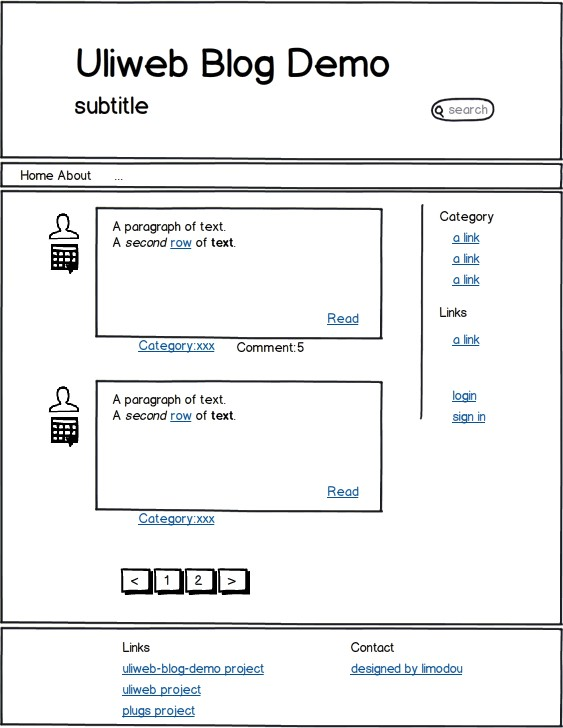
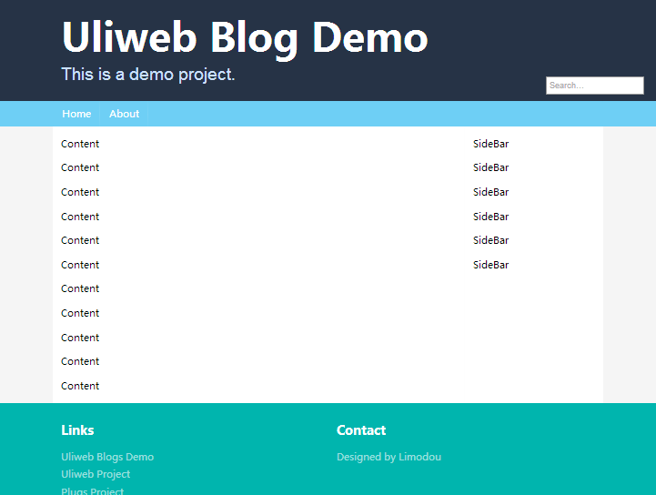

# 全局设计

## 界面布局

一个典型的应用，根据用户不同，一般分为：普通用户和系统用户。当然，我们可以根据
实际情况进行更细的划分。因此界面也可以分为普通界面和管理界面。不同的页面它们的
风格应该是统一的，因此一般会考虑将界面通用部分放到统一的模板中，然后具体的页面
分别从这些模板继承。因此对于我们这个项目，我们将创建两个父模板： `layout.html` 和
`admin_layout.html`, 分别对应一般页面和管理页面。

界面设计是一件复杂而又相对专业的工作，现在已经有不少优秀的开源CSS框架可以让我们
直接使用，常见的有 [Bootstrap](http://getbootstrap.com/), 
[Semantic-UI](http://semantic-ui.com/), [Fundation](http://foundation.zurb.com/).
这里我选择Semantic-UI这个css框架。

## 创建 APP

### 创建 home, admin 和 semantic APP

让我们分别创建 home 和 admin 这两个app，其中 home 用来存放普通用户使用的全局性的
内容，包括整站的CSS，JS和模板。而 admin 用来存放后台管理使用的全局性的内容。

为了存放semantic的静态资源，同时创建semantic app。

```
cd uliweb_blogs
uliweb makeapp home
uliweb makeapp admin
uliweb makeapp semantic
```


在uliweb 0.2.4版本之后，还可以使用 `uliweb makeapp home admin semantic` 一次性
创建多个app。


### 配置 APP

App创建之后，需要在 `apps/settings.ini` 中进行配置，如现在的 settings.ini 内容是：

```
[GLOBAL]
DEBUG = False
DEBUG_CONSOLE = False
DEBUG_TEMPLATE = False

#INSTALLED_APPS = [
#    'uliweb.contrib.staticfiles',
#    'uliweb.contrib.template',
#    'uliweb.contrib.upload',
#    'uliweb.contrib.orm',
#    'uliweb.contrib.session',
#    'uliweb.contrib.cache',
#    'uliweb.contrib.auth',
#    'uliweb.contrib.i18n',
#    'uliweb.contrib.flashmessage',
#    ]
```

前三个 `DEBUG*` 是与调试相关，在 `local_settings.ini` 又重新定义为了 `True` (DEBUG_TEMPLATE)
除外。其目的就是：当部署时，这些开关项不生效。但是在本地调试时生效。

`INSTALLED_APPS` 是最重要的用来设置哪些 App 生效的配置。在Uliweb中，App可以是任何
合法的python包，因此可以引入第三方的App。在配置的时候，需要使用字符串的表示形式，
它表示这个App的导入路径。例如 `uliweb.contrib.orm` 表示，在启动应用时，Uliweb可以
直接导入 `uliweb.contrib.orm` 这个包。

上面这个是自动生成，已经列出了常见的一些App，只不过全部注释掉了，因此我们根据需要
去掉一些注释，并且将我们新建的App添加在后面。因此上面的代码改为：

```
INSTALLED_APPS = [
    'uliweb.contrib.staticfiles',
    'uliweb.contrib.template',
    'uliweb.contrib.upload',
    'uliweb.contrib.orm',
    'uliweb.contrib.session',
#    'uliweb.contrib.cache',
    'uliweb.contrib.auth',
    'uliweb.contrib.i18n',
#    'uliweb.contrib.flashmessage',
    'semantic',
    'home',
    'admin',
    ]
```

其中：

* `uliweb.contrib.staticfiles` 用来处理静态文件
* `uliweb.contrib.template` 用来处理 use, link 标签
* `uliweb.contrib.upload` 用来处理文件上传下载
* `uliweb.contrib.orm` 用来处理数据库的ORM
* `uliweb.contrib.session` 用来处理session
* `uliweb.contrib.cache` 用来处理cache，暂时用不上
* `uliweb.contrib.auth` 用来定义用户相关的表及用户认证
* `uliweb.contrib.i18n` 用来进行国际化处理
* `uliweb.contrib.flashmessage` 用来实现静态化的flash信息显示，暂时不用


有的时候，App的顺序很重要。因为Uliweb的一些机制，如：配置文件导入顺序，模板查找，
静态文件查找等都和顺序有关系。例如，两个App可能有重名的模板，那么Uliweb会最终使用
排列在最后那个App的模板， **即后定义的会覆盖前面的同名资源** 。

这种机制还可以允许用户定义第三方的App，以替換原来的App的实现，以实现新的功能。

所以，建议是把Uliweb内置的App放在最前，第三方的App放在中间，自定义的放在最后。


## 向 semantic App 添加资源

### 拷贝文件

为什么不直接把semantic的静态资源直接放到 home 或 admin 中呢？就是因为想要复用。

访问 [semantic-ui](https://github.com/Semantic-Org/Semantic-UI) 的 github 页面，
可以直接下载 zip 文件或 clone 这个项目。找到其中的 `build\packaged` 子目录。将
其拷贝到 `semantic/static/semantic` 目录下。注意，`semantic` 要创建，原来是没有的。


通常，与app相关的静态资源，我都会在static目录下创建与app同名的子目录，将静态文件
放在这个目录下，主要是防止在进行静态文件抽时，万一有同名的文件会进行覆盖，而放在
不同的子目录下就可以避免这个问题。


### 删除 semantic/views.py 文件

因为semantic app只是用来存放静态文件，所以并不需要 `views.py`，因此我们把它删除。

### 创建 use 配置

uliweb.contrib.template app提供了在模板中可以使用的use标签，可以方便引用静态文件。
具体的详情可以参见 [template app](../app_template.html)。use 内容的定义可以使用
.py 文件和配置文件两种方式。这里我们简单使用配置文件的方式。

在 semantic app下创建 settings.ini ，然后输入：

```
[TEMPLATE_USE]
semantic = {
    'toplinks':[
        'semantic/css/semantic.min.css', 
        'semantic/javascript/semantic.min.js']
}
```

那么，当我们在模板中使用 `{{use semantic}}` 时，Uliweb在渲染模板时，会将它替換
成：

```
<link rel="stylesheet" type="text/css" href="/static/semantic/css/semantic.min.css"/>
<script type="text/javascript" src="/static/semantic/javascript/semantic.min.js"></script>
```

可以看到， css 和 js都生成了正确的链接形式。同时它会自动添加到Html页面中的 `</head>`
之前。而不是定义的地方。


理解这一点很重要，这样你就可以在模板中的任何地方使用 ``{{use}}`` 。use的使用顺序
也是要注意的，因为有些静态文件是有依赖如，如 jquery 的一些插件。所以要先引用
jquery ，然后才是其它的插件。所以 jquery 这样的就要写在前面。

除了 use 还有一个只能引用一个文件的标签 `link` 。它可以引入 static 下的一个静态
文件并正确处理 css 和 js。如：

```
{{link "home.css"}}
```

将生成：

```
<link rel="stylesheet" type="text/css" href="/static/home.css"/>
```


link 也会将生成的链接自动插入到 `</head>` 之前。

### 静态URL的生成

从上面生成的链接可以看出，静态文件前面都是以 `/static/` 开始的，这主要是为了后
面部署到web server时更方便，并且可以规范项目结构，所以在app下的模板文件要放在
`templates` 目录下，也是一个道理。

如果你希望将链接插入到当前位置，而不是自动插入到 `</head>` 之前，那么可以这样处理：

```
<link rel="stylesheet" type="text/css" href="{{=url_for_static('home.css')}}"/>
```

通过调用 `{{=url_for_static(filename)}}` 来生成路径，不过这里 filename 是一个相对
路径。同时你要手工生成完整的链接。


`url_for_static()` 是在配置了 `uliweb.contrib.staticfiles` 这个app之后自动注入到
模板中的，所以可以直接使用。

 
### 引入 jquery

不过 semantic 还需要 jquery 才可以使用，因此我们还需要配置 jquery。在plugs项目
中已经包含了 jquery ，所以我们可以直接使用它。

使用第三方包其实有两种办法，一种是在 `apps/settings.ini` 中的 `INSTALLED_APPS` 
中进行配置，另一种是通过Uliweb提供的App依赖。第一种当别人复用你的app时，也要同
样对 settings.ini 进行配置。第二种则会在复用你的app时，自动引入依赖的app。所以
这里为了以后方便使用semantic app，使用第二种定义方法。

在 semantic app下定义 `config.ini`，内容如下：

```
[DEPENDS]
REQUIRED_APPS = [
    'plugs.ui.jquery.jquery', 
]
```

有了这个依赖，我们就不需要去修改 `apps/settings.ini` 了。

但是在模板中使用 jquery 还不够。在 `plugs.ui.jquery.jquery` 中也提供了 `{{use jquery}}`,
不过，我们要显示地调用才可以。如果想省事，我们可以修改 `TEMPLATE_USE/semantic` 的
定义，改为：

```
[TEMPLATE_USE]
semantic = {
    'toplinks':[
        'semantic/css/semantic.min.css',
        'semantic/javascript/semantic.min.js'],
    'depends':['jquery'],
}
```

这里用到了 use 定义中的依赖处理，意味着，我们在 `{{use semantic}}` 时，会自动加
入 jquery 的链接。

### 修改jquery的版本

有些plugs中与UI相关的app，因为版本比较多，所以提供了对版本的设置支持。象jquery
就是一例。在plugs中缺省的jquery版本号是 `1.7.2`, 所以，如果你想使用其它的版本，
如 `1.9.1` 可以在 `semantic/settings.ini` 中定义：

```
[UI_CONFIG]
jquery_version = '1.9.1'
```

## 创建 layout.html

### 修改 home, admin 的views.py

因为使用 `makeapp` 创建app时，会自动生成一个 views.py，它会缺省生成 `/` 的view函数,
所以会产生冲突，因为有两个 `/`。让我们把 `admin/views.py` 中的代码先注释掉，不让
它生效，如：

```
#@expose('/')
#def index():
#    return '<h1>Hello, Uliweb</h1>'
```

然后把 `home/views.py` 中的views.py改为：

```
@expose('/')
def index():
    return {}
```

让它返回一个 dict 数据，这样就可以自动套用模板了。


自动套用模板是Uliweb的机制，当view函数（指使用 `@expose` 修饰的函数或类方法）返
回数据为dict时，Uliweb会自动根据是一般函数或是类方法来自动使用模板。模板名将与
函数名相同。如果是类方法，则模板映射为 `ClassName/FunctionName.html` 的文件名。


### 创建 index.html

`index()` 对应的模板文件是 `index.html` ，所以先让我们创建 `home/templates/index.html` 
文件，内容为：

```
{{extend "layout.html"}}
```

`extend` 说明 index.html 模板将从 `layout.html` 进行继承。

首页和具体的blog展示页面可能有所不同，首页一般是信息的聚合，而每个blog只会展示
单篇文章。并且首页会有banner，可能设计得更好看。这里我们先留成空的，等后面细化时
再进行修改。

### 创建 layout.html

其实，如果不使用象 semantic 这样的css框架，我们还可以选择参考一些别人设计好的
展示页面，有一些免费的模板可以下载。然后根据模板的内容，将需要动态生成的使用模
板变量和block进行处理，以便与view提供的数据进行结合。

这里我们将从头设计展示页面，但是和你改造一个现成的页面是类似的。

我先简单设计一下，我想象中的首页大概是这样的：



其中，最上面的头，菜单以及最下面的页脚可以看成是比较通用的，因此我们的layout就
可以主要包含这里内容，而其它的内部只留出空间，让子模板来继承并覆盖即可。

内容比较长，所以让我们一段段看：

```
<!DOCTYPE html>
<html>
<head>
<meta http-equiv="Content-type" content="text/html; charset=utf-8" />
<title>{{=settings.HOME.title}}</title>
</head>
{{use "semantic"}}
{{link "home.css"}}

<body>
```

这是Html的头部分，其中 title 的值使用了模板语法, `{{=settings.HOME.title}}` 表示
从settings中获取 `HOME` 下的 `title` 值。

在模板中可以直接使用settings中定义的配置项。为了方便修改，有些值是写到settings中
去了，如： title, name, site, description。

然后模板中还使用了 `use` 和 `link` ，关于 use 和 link 的使用，前面已经说过了。

我把 layout.html 中相关的自定义 CSS 都写在了 `home.css` 中，就不再细说了。

```
<!-- Header -->
<div class="ui page grid" id="introduction">
    <div class="column">
        <h1 class="ui header">{{=settings.HOME.name}}
            <h2 class="sub header">{{=settings.HOME.description}}</h2>
        </h1>
        <form action="http://www.google.com/search" method="GET">
            <input name="sitesearch" value="{{=settings.HOME.site}}" type="hidden">
            <input id="search_bar" name="q" type="text" placeholder="Search..."></input>
        </form>
    </div>
</div>
```

这是Banner的定义，使用了 settings 中定义的 `name` (即应用名称) 和 `description` (应
用描述)。同时还添加了一个搜索框，使用google来搜索。为了限制在当前网站，所以还
使用了 settings 中的 `site` 。所以你要在settings中定义这些值。

```
<!-- Menus -->
<div class="ui page grid" id="menus">
    <div class="ui blue inverted menu">
        <a href="/" class="item">Home</a>
        <a href="/about" class="item">About</a>
    </div>
</div>
```

这里定义了一个菜单，目前只有两项，并且没处理活动菜单的高亮。

```
<!-- CONTENT -->
{{block content_container}}
<div class="ui page grid">
    <div class="ui divided grid" id="blogs">
        <div class="twelve wide column">
            {{block content}}
            <p>Content</p>
            <p>Content</p>
            <p>Content</p>
            <p>Content</p>
            <p>Content</p>
            <p>Content</p>
            <p>Content</p>
            <p>Content</p>
            <p>Content</p>
            <p>Content</p>
            <p>Content</p>
            {{end}}
        </div> 
        
        <div class="four wide column">
            {{block sidebar}}
            <p>SideBar</p>
            <p>SideBar</p>
            <p>SideBar</p>
            <p>SideBar</p>
            <p>SideBar</p>
            <p>SideBar</p>
            {{end}}
        </div>
    </div>
</div>
{{end}}
```

这里定义了三个block(块)： `content_container`, `content` 和 `sidebar` 因此你可以在子模
板中覆盖它们的内容，并且 `content_container` 包含了其它两个block。

```
<!-- FOOTER -->
<div class="ui page grid" id="footer">
    <div class="column">
        <div class="ui two column stackable grid">
          <div class="column">
            <div class="ui header">Links</div>
            <div class="ui inverted link list">
              <a target="_blank" class="item" href="http://github.com/limodou/uliweb-blogs-demo">Uliweb Blogs Demo</a>
              <a target="_blank" class="item" href="http://github.com/limodou/uliweb">Uliweb Project</a>
              <a target="_blank" class="item" href="http://github.com/limodou/plugs">Plugs Project</a>
            </div>
          </div>
          <div class="column">
            <div class="ui header">Contact</div>
            <div class="ui inverted link list">
              <a target="_blank" class="item" href="mailto:limodou@gmail.com">Designed by Limodou</a>
            </div>
          </div>
        </div>
    </div>
</div>
</body>
</html>
```

这里定义了页脚。

上面元素中使用的是semantic的定义方式，具体的涵义不是本教程的重点，所以不细说了。

## 添加配置信息

前面在模板中用到了 `settings.HOME` 中的一些值，所以让我们在 `apps/settings.ini`
中定义它。你也可以定义在 `home/settings.ini` 中，不过它更多是关于应用本身，所以
一般就放在了 `apps/settings.ini` 下了。在文件最后添加：

```
[HOME]
title = 'uliweb blog demo'
name = 'Uliweb Blog Demo'
description = 'This is a demo project.'
site = 'http://limodou.github.com/uliweb-doc'
```

其中site是用来实现站内搜索的，所以应该改成你所用的网站地址。

## 测试效果

到这里，我们可以先看一下我们已经实现的成果。

在 `uliweb_blogs` 目录下运行 :

```
uliweb runserver
```

这样就启动了开发服务器，并且可以看到日志输出是带有颜色的。如果不想要颜色输出，可以添加 `--nocolor` 参数。
输出结果大概是这个样子：

```
[INFO]  * Loading DebuggedApplication...
[INFO]  * Running on http://localhost:8000/
[INFO]  * Restarting with reloader
[INFO]  * Loading DebuggedApplication...
```

说明启动成功，并且自动启动了Debug调试功能。根据提示，我们打开浏览器，输入地址 
`http://localhost:8000/` ，如果运行正确的话，这里我们会看到：



## 关于开发服务器

Uliweb的开发服务器在缺省情况下可以自动探测代码的变化，然后自动重启。所以通常情况
下，你只要修改，然后刷新页面就可以了。不过有些情况要特别注意：

1. 修改了模板文件，因为它不会缓存到内存，所以服务器不会重启，但是会立刻生效
2. 添加新的文件，如模板，views.py等，因为Uliweb在启动时会对文件名进行记录，所以
   新増文件由于没有记录，所以不会自动重启。需要手工重启。

## 关于命令行

Uliweb的命令行在只输入 `uliweb` 时会显示可用命令及全局的参数，并且会根据配置的
app来显示app下可用的使用。所以，配置不同的app，可能可以使用的命令是不同的。

如果想查看详细的命令，可以输入：

```
uliweb help command
```
