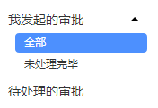

# menus - 菜单管理

## 以前的实现

在uliweb设计中，许多内容都是分布式可配置的。但是菜单却不是这样。一般的uliweb网站有两类的菜单，一种是导航菜单，比如首页上用来区分不同的大的功能，一般只有一层；另一种是侧边栏菜单，用来显示每个大功能对应的详细功能，可以是多级，一般组织为树型。为了简单，以前对于第一类菜单就是在settings.ini中写一个配置，如：

    [LAYOUT]
    TITLE = _('Red Breast Demo')
    PROJECT = _('Red Breast')
    MENUS <= [
        ('home', _('Home'), '/'),
        ('admin', _('Admin'), '/user/view'),
    ]

其中MENUS就是菜单的定义。然后在模板中可以定义一个menu函数，需要传入一个参数current用来指示当前高亮的是哪个。如：

    {{menu('home')}}

对于第二类菜单，会在某个功能的 func\_layout.html 模板中定义这个功能下的所有菜单，如：

    {{
    menu_items = []
    if request.user:
        menu_items.append(
            {
            'name': 'user',
            'title':_('Settings'),
            'subs':[
                    {'name': 'information', 'title':_('Information'), 'link':'/user/view'},
                    {'name': 'password', 'title':_('Change Password'), 'link':'/user/change_password'},
                    ]
            },
        )
    pass
    }}

使用时，通过定义了一个submenu函数，将上面的menu\_items传入，同时指定当然高亮的菜单参数。如上面的结构中，想要高亮 information 菜单，需要： `{{submanu(menu_items, 'user', 'information')}}` 。

从上面的实现可以看出虽然很简单，但是有以下几个问题：

1. 定义方式不统一
2. 定义是集中式的，不利于插件式的项目组织方式。比如増加或去除app之后，还需要将相应的菜单进行修改。并且因为菜单的定义是集中式的，所以这个文件有可能在同时进行多个app修改时会产生冲突。
3. 对菜单的权限控制比较弱。上面是通过if语句来处理的，但是对于复杂情况就不方便处理。

因此为了让菜单定义，使用更独立，我在plugs中添加了menus app，对菜单的处理进行了新的设计。

## 新的实现

首先在menus app中定义基本的结构，主要分为：

1. 启动处理。定义了初始化处理 (`after_init_apps`)，它将会收集所有定义在settings.ini中的MENUS中的菜单项。然后根据菜单定义的结构，重新组合为树型结构。
2. 菜单结构。菜单定义支持多棵树，每模树都是一个完整的菜单结构。每模树的根结点都有一个名字，以进行区分。每个菜单项也都有自已的名字。同一个结点的子结点不允许重名，但是不同结点的子结点可以重名。整个菜单数据将保存到一个有序字典变量中。所以第一层就是不同的菜单树的根结点。根结点本身不用来显示。通过 `get_menu(name)` 可以得到某个菜单树。同时 name 是用 `/` 分隔的，如： `a/b` 表示返回根为 `a` 的菜单树中的 `name` 为 `b` 的菜单项。
3. 菜单的定义。菜单要定义在 settings.ini 中的MENUS中。基本格式为：

        [MENUS]
        name1 = {'title':'title', 'subs':[
             {'title':'title', 'link':'link'},
             {'title':'title', 'link':'link'},
            ]}
        name2 = {'parent':'name1', 'title':'title', 'link':'link'}

    基本格式为 `name={}` 。其中值的部分是一个dict，可以有以下属性：

    * **parent** 可以缺省。如果不是在subs中，如果不存在或值为空时，则表示它是一个根结点。如果有值，则表示它是parent的子菜单，此时parent可以是用 `/` 分隔的字符串。如果不带 `/` 则会将匹配上的第一个菜单项作为父结点，如果带 `/` 则会按树型结构层层匹配。因此，如果要匹配有重名的结点时，要使用带 `/` 的形式。
    * **order** 表示顺序值。缺省为900。在生成菜单树时，同一父结点下的菜单项将按order进行排序。
    * **title** 表示菜单显示名。
    * **link** 表示链接。对于父菜单应为空或不提供。
    * **name** 表示菜单名。对于key=value的定义，key将自动保存到 `value['name']` 上。但是对于定义在subs中的子菜单，要显示定义name值。
    * **check** 校验函数。当返回为True时显示菜单。详情见权限控制。
    * **subs** 表示子菜单。可以通过定义parent来关联父子菜单，这种形式更适合将不同的app的菜单进行组合。对于一个app中的菜单，可以直接通过 subs 来定义子菜单，同时不需要定义parent。注意，在定义subs时需要指明它的name值。

4. 显示菜单。为了通用，其实并不需要定义展示部分，可以由用户自已处理。通过 `get_menu()` 来返回菜单项即可，然后自已编写显示代码。不过为了方便，menus实现了缺省的菜单显示。它使用一个jquery的插件 [navgoco][1] 来显示菜单。在menus中提供了一个menu()函数，它可以生成navgoco所需要的html代码。为了方便引入navgoco所需要的js及初始化js代码，menus提供了inc_menu.html模板，可以让用户在需要的地方通过 `{{include "inc_menu.html"}}` 来引入相应的内容，并在模板上定义了 menu() 函数。在这个函数中使用了 menus 中的menu函数。但是为了通用，并不是直接引入，而是通过functions.menu来调用，这样可以让用户在需要的时候替換为自已的方法。

    在 inc\_menu.html和menus中各有一个menu函数。menus的menu只是单纯的生成菜单结构的html代码。而inc\_menu.html是为了在模板中提供更一致的调用接口和方便生成html以及javascript代码，它会调用menus中的函数。所以一般使用的是模板中的menu函数。

5. 权限控制。除了上面必输的一些属性外，你还可以自已添加一些属性用来进行特殊的处理。在plugs的menu函数中，还提供了权限控制支持。它可以传入一个check参数，用来检查菜单项是否要显示（注意，这里只决定要不要显示，并不能防止用户直接输入url来访问），这是一个回调函数，函数原型为 `def validator(menuitem, context)` , menuitem为要处理的菜单项，context为上下文对象，它是一个dict。主要是用于进行缓存处理，在每次调用显示菜单中将置为 `{}` 。在后面的default\_validator中用它来缓存has\_role和has\_permission的结果。如果返回True表示可以查看，返回False为看不到。在menus app中实现了一个缺省的检查函数，它是 plugs.menus.default\_validator，它可以检查菜单项定义中的roles和permissions属性，因此它要使用 uliweb.contrib.rbac这个app。这个缺省的检查函数将与用户传入的check函数一起生效，因此哪怕你不传check参数，default\_validator也会生效。如果不想让它生效，要么自已写一个menu函数，不再使用menus提供的缺省实现，自然不会进行这样的处理；要么修改settings.ini中的配置MENUS_CONFIG，使用 `validators <= []` 。注意 `<=` 是表示不进行自动合并，而是替換。

## 命令行显示

为了方便查看菜单结构，menus提供了menu命令，如：

    uliweb menu
    uliweb menu main
    
第一个命令将显示全部菜单树，第二个只显示指定的菜单树。显示结果如：

    MAIN [MAIN]
        home [Home]
        admin [Admin]

每项的前面是名字，后面是标题。如果有中文，它是按settings.ini的编码，有可能控制台上看到的是乱码。

## 使用示例

1. 在 `INSTALLED_APPS` 中配置 `plugs.menus`
2. 在对应的app下配置MENUS，如：

        [MENUS]
        main = {'subs':[
                {'name':'request', 'title':'我发起的审批', 'subs':[
                    {'name':'request_all', 'title':'全部'},
                    {'name':'request_unfinished', 'title':'未处理完毕'},
                ]},
            ]
        }
        process = {'parent':'main', 'title':'待处理的审批',
                'link':'/review/list?status=0', 'roles':['superuser']}

   上面其实只定义了一个菜单树 - main，process的父菜单是 main，所以它将合并到main菜单中。在process菜单中还定义了一个roles，它表示只有超级用户才可以看到。
3. 在将要显示菜单的模板中找一个地方添加 `{{include "inc_menu.html"}}`
4. 在将要显示菜单的模板中显示菜单的地方添加 `{{menu('main')}}` 这样将显示main菜单。如果要指定选中的项，可以 `{{menu('main', 'request/request_all')}}` 这样在显示菜单时request\_all菜单将自动高亮。并且我处理了菜单展示，如果活动菜单项是子菜单，则会自动将父菜单打开，而不是折叠状态。

显示效果为：

 [1]: https://github.com/tefra/navgoco
