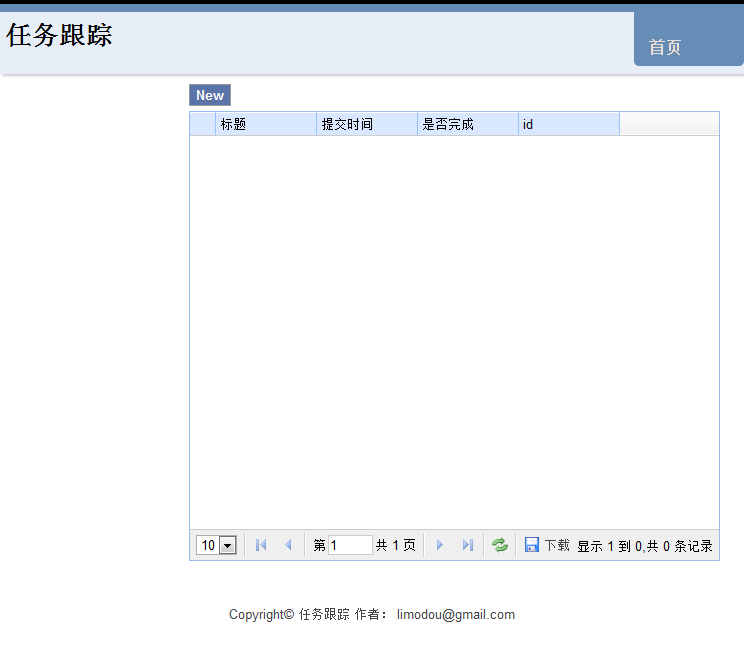

# Simple Todo (Uliweb 版本) 之 高级篇

本版本是从 [http://simple-is-better.com/news/detail-309](http://simple-is-better.com/news/detail-309) 来的，并且已经使用Uliweb
实现了一个 [基础版本](http://limodou.github.com/uliweb-doc/basic.html) ，不过
这个基础版本讲述的是最基本的Uliweb的用法，因此叫基础篇。
在这个高级篇中，我希望向大家介绍更加高级一些的内容。其中有些功能要依赖于plugs和
generic的一些功能。

plugs是我在开发时把认为可以复用的一些app发布出来，供大家使用。它收集了象基本的
页面布局，通用的view函数，jquery相关的一些界面代码和控件，以及其它的一些配套
功能。但是在这个教程中只会使用部分功能。plugs本身是需要安装，你可以直接下载源码
进行安装，也可以通过 `easy_install plugs` 或 `pip install plugs` 来安装。不过因
为目前plugs还在不断优化中，因此建议直接通过下载源码来安装。现在plugs可以在
[http://code.google.com/p/plugs](http://code.google.com/p/plugs) 和 [https://github.com/limodou/plugs](https://github.com/limodou/plugs) 都可以找到。

generic在plugs中存在一个app，它提供了封装好的view函数，可以直接使用。类似于django
的generic_view的功能。它提供了class-based的view和function-based的view方法，你可
以根据需要来使用。

同时在uliweb中还提供了generic.py模块，它提供了更底层的view的调用，分别对应于:
list, add, edit, view, delete。而plugs中的generic又是使用了generic.py模块的功能
来实现。generic.py的功能我认为非常强大，我会用专门的文档来进行介绍。


## 构建流程


### 构建初始环境

在基础篇中讲过的内容，这里不再缀述。假定目前初始为$project，操作如下:


```
uliweb makeproject plugs_todo
cd plugs_todo
uliweb makeapp todo
```


## settings.ini配置

修改apps/settings.ini为以下内容:


```
[GLOBAL]
DEBUG = True

INSTALLED_APPS = [
    'plugs.generic',
    'plugs.layout',
    'uliweb.contrib.orm',
    'todo',
    ]

[ORM]
CONNECTION = 'sqlite:///database.db'
AUTO_CREATE = False

[I18N]
LOCALE_DIRS = ['$[plugs]']
SUPPORT_LANGUAGES = ['en', 'zh_CN']
```

ORM段中我使用了sqlite数据库，同时关闭自动创建表的选项。在 `INSTALLED_APPS` 中加入
了'plugs.layout'和'todo'这两个app。由于使用了plugs，它是支持i18n的处理，因此上面
I18N一段就是相关的配置。在这个小网站，我们可以使用英文和中文。


## 基本布局

前面我们看到了，已经加入了 `plugs.generic` 和 `plugs.layout` 这两个app，其中 `plugs.generic`
提供了通用的Model的CRUD(Create Read Update Delete)的处理展示。在非常简单的情况下
可以直接使用它来生成相应的界面。而 `plugs.layout` 提供了基本的布局。在layout中
的settings.ini中有几个参数可以设置，缺省值为:


```
[LAYOUT]
COPYRIGHT = _('All rights reversed!')
TITLE = _('Uliweb Plugs Demo')
MENUS = [
    ('home', _('Home'), '/'),
    ('admin', _('Admin'), '/user/view'),
    ('about', _('About'), '/about'),
]
```

让我们修改一下，添加到apps/settings.ini中去:


```
[LAYOUT]
COPYRIGHT = 'Copyright&copy; 任务跟踪 作者： limodou@gmail.com'
TITLE = '任务跟踪'
MENUS <= [
    ('home', '首页', '/'),
]
```

这里有一个特别的地方，那就是MENUS <= 它的作用是替换原来的值。因为pyini在处理时，
如果遇到相同名字的两个变量，如果变量是不可变对象，则直接替换，如：str, int等。但
如果值是可变对象，如：list, dict，则会进行合并。因为上面的MENUS是list，所以缺省
情况下会进行合并，而我们的目的是想替换，所以使用 `<=` 就可以替换了。

为了运行，我们首先要修改一下plugs_todo/apps/todo/views.py，改
为:


```
#coding=utf-8
from uliweb import expose

@expose('/')
def index():
    return {}
```

然后我们在plugs的layout.html的基础上，来创建一个通用的基础模板，如命名为base.html,
内容如下:


```
{{extend "layout.html"}}

{{block userinfo}}{{end}}
```

因为layout.html中还有用户的信息，但是我们这里并不使用，因此，我们将block userinfo
置为空。

然后在todo/templates下创建index.html，内容为:


```
{{extend "base.html"}}
```

好，目前差不多了，让我们回到命令行，在plugs_todo目录下运行:


```
uliweb runserver
```

如果没有错误，可以通过访问 [http://localhost:8000](http://localhost:8000) 看到如下界面:


## 创建Todo的Model

下面就是创建Todo表的结构。在todo下创建models.py文件，写入以下内容:


```
#coding=utf-8
from uliweb.orm import *

class Todo(Model):
    title = Field(str, verbose_name="标题", max_length=255, required=True)
    post_date = Field(datetime.datetime, verbose_name='提交时间', auto_now_add=True)
    finished = Field(bool, verbose_name='是否完成')
```

在todo下创建settings.ini，然后输入以下内容:


```
[MODELS]
todo = 'todo.models.Todo'
```

这样我们就将todo表做成配置化的了。关于配置化，详情可以查看 [Uliweb ORM](http://limodou.github.com/uliweb-doc/orm.html) 的文档。

在命令行下运行:


```
uliweb syncdb
```

来创建表。


## 处理Todo

下面开始写展示Todo列表的代码了，让我们看一下如何使用plugs.generic中的View Class。
编辑 todo/views.py 如下:


```
#coding=utf-8
from uliweb import expose
from plugs.generic.views import View
from uliweb.i18n import ugettext as _

@expose('/')
class Todo(View):
    model = 'todo'
    layout = 'base.html'
    key_field = 'title'
#    add_button_text = _('New')
#    pagination = True
#    rows = 10

    @expose('/')
    def list(self):
        return View.list(self)
```

可以看到我们从plugs.generic.views中导入了View类，然后从这个类派生了Todo的子类。
View类中已经预定义了象list, view, edit, delete, add等方法。基本的功能，包括展示
已经全部由View来实现，你只要进行必要的配置就可以实现一个非常快速的录入。当然，
在实际的项目中我们可能不会这么简单，但是这至少是一个可以表现复用性的例子。

在Todo中还定义了一些类属性，用于具体的配置。如model对应要处理的表。layout表示整
体要使用的布局文件，这里是base.html。key_field是表示在显示列表时，哪个字段将展
示为相应的查看链接。其它的给注释了，它们显示的都是相应的缺省值。可以看到它还包含
了相应的分页的处理。

上面 `_('New')` 是i18n(国际化)处理的例子。 `_` 是在 `from uliweb.i18n import ugettext as _` 中定义的。

改完以后，再运行，结果是这个样子。




这里的代码已经完成了整个的：列表显示，增加，删除，修改，查看的功能。但是它是以
一种预定义的方式来展示的，可能不能满足你的要求，但是作为快速开发会非常方便。

你仍然可以使用更底层一些的generic.py来实现更加个性化的代码。


## 后记

其实在plugs的相应的app中封装了好多的东西。比如flash message，表格的分页处理，
由Model转为Form的机制，下载的处理等。还包括一些ui的处理，如对jquery easyui的封
装等。它们都是构成plugs的基础，我会不断完善它们。

