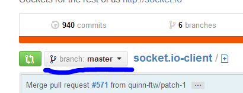

# 在gevent及gevent-socketio上运行

在前面将tornado的支持添加到uliweb中之后，今天又完成了对gevent和gevent-socketio的支持。这里的支持是指可以在它们上面运行。因为tornado, gevent, gevent-socketio都可以作为服务器来跑wsgi的应用。我对两者的了解都不是太多。我之所以要研究它们，主要是想看一看能不能使用它们做一个基于socketio的聊天室的功能。使用socketio最主要的是使用websocket。当然socketio还支持其它的模式。这里我主要是想对socketio做支持。tornado有WebsocketHandler，不过看不去很难与uliweb集成，因为它的处理模式很特殊，很难用普通的view来处理。因此，我后面转到了gevent-socketio上。

gevent的好处是通过monkey.patch_all()，将原来同步的IO操作处理为协程操作。这样，你的代码还是原来的同步的写法，并不需要特殊的写法，因此我认这是它的最大的一个优势。而gevent-socketio是在gevent的基础上实现了对socket.io js库的支持。

socket.io是一个js的库，它既有服务器版本，可以运行在node.js上，也有client版本，运行在浏览器上。其实你完全可以使用socket.io实现服务器和客户端。不过这里我是想用uliweb来做为服务端。gevent-socketio提供了服务端的基础实现，使得对socket.io的支持做到简化。目前socket.io可以支持namespace，这样可以在客户端同时处理多个不同类型的请求，但是通过一个socket连接。并且它的通讯格式是带命令串的，这样发送和响应时都非常方便。socket.io给我的感觉还是挺简单的。但是在我安装socket.io的客户端时遇到了一个问题。socket.io的版本是分服务器和客户端的，如果你直接到 https://github.com/LearnBoost/socket.io-client 会看到 socket.io-client.js，不过这个其实不是直接可以在浏览器使用的版本。后来我在wiki看到说是在dist中，但是在这个仓库中看不到这个dist目录。很奇怪。后来是在 [这篇文章](http://blog.pythonisito.com/2012/07/realtime-web-chat-with-socketio-and.html) 中的链接中找到0.9.6的一个版本，其中有dist。很奇怪。后来我发现，现在最新的tag版本是0.9.16，原来可以将版本切換到对应的标签后，就会看到dist目录。如下图：

搞定了socket.io-client，我又参考了上面的文章和gevent-socketio的一些例子。例子倒是没什么问题，但是发现werkzeug的DebugApplication和gevent配合的问题。如果我使用Debug模式，gevent处理就会有问题，去掉就好。于是我开始搜，找到gevent-socketio的一个[issue][2]，其中有人分析是DebugApplication的 `__call__` 返回的是Generator，造成了问题，但是答案还没来得及给出。我又在stackoverflow上找到一个回答，上面也提到了前面的issue，并给出了一个[解决方案][3]，就是派生一个新的DebugApplication子类，然后情况来返回不同的内容。避免了总了返回generator的情况。不过，它是判断如果是socket.io请求，就直接跳过DebugApplication的处理，如果有异常也不会象一般的页面一样显示异常页面。现在想想这个不太好解决，所以只能凑合了。

现在uliweb和支持tornado一样，可以在开发时启动开发服务器，使用 `--gevent` 和 `-gevent-socketio` 来分别使用不同的服务模式。如果是要部署，可以运行：

    uliweb support gevent-socketio

这样会在当前的项目目录下生成 `gevent_socketio_handler.py` 文件，可以直接运行。可以使用 `-h` 和 `-p` 来传入IP和端口号。

  [2]: https://github.com/abourget/gevent-socketio/issues/114
  [3]: http://stackoverflow.com/questions/18319345/gevent-socketio-not-using-my-app-route-endpoint-for-socketio
