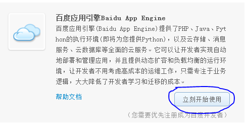
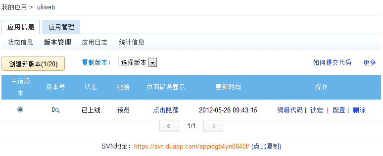
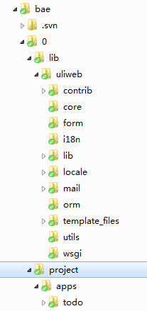

# BAE 部署及开发指南

Baidu Application Engine(简称bae)是百度发布的类似于GAE的云环境，目前提供了对
python的支持。不过现在还要测试过程中，所以以下的部署说明有可能会发生变化。bae
的环境有些和sae(Sina Application Engine)类似，不过还是有一些区别，后面会简单
介绍。本文档假设你已经有了bae的帐号。


## Python项目创建

为了使用Uliweb你的第一步是要先创建一个Python的项目，目前需要有邀请码并由管理人
员开通。不要问我要邀请码，因为我只有一个，为了做测试已经用掉了。


1. 进入 [http://developer.baidu.com/service](http://developer.baidu.com/service)
1. 点击百度应用引擎，点击 “立刻开始使用”





1. 然后创建应用
1. 创建好后，大概是这样:


1. 点击版本管理后，新建一个版本。这里bae的版本和sae差不多，都是用数字作为版本
    目录。它是从0开始。创建好后，在下面可以看到svn的地址。这样可以用Svn工具checkout
    代码了。用户名口令就是百度的用户名口令。






要注意的是，我在使用chrome 21.x dev版本时报了一些js的错，所以后来切換到了
ie上来执行。说是我的chrome版本太高了，不知道算不算bug。



1. 缺省情况下，刚checkout出来的代码只有3个文件:

    ```
    app.conf
    favicon.ico
    index.py
    ```

其中index.py是启动文件，这个后面我们要修改它，app.conf就象是GAE的app.yaml的
    内容，可以设置 url 的配置信息等。在bae的文档上有更详细的说明。

其实到这里，应用应该已经可以跑起来了。bae已经生成了缺省的环境。点某个版本上的 **预览**
就可以看到当前版本号执行的效果。

下面就开始 Uliweb 的部署过程。


## uliweb的部署


### uliweb安装

这里我不会演示一个 Hello, Uliweb 如何做，太简单了。我会使用 uliwebdoc 下的 SimpleTodo
的例子来做。它的代码你可以从 [uliweb-doc](https://github.com/limodou/uliweb-doc) 项目
中的 projects中找到，不过这个版本还不能直接运行到 bae 上去，所以需要进行必要的修改。

目前uliweb最新版本是0.1，在发布时还没有对bae作特殊的支持处理。所以你要从svn或github
上下载最新的 [uliweb](https://github.com/limodou/uliweb) 的源码。点击上面的zip图标
就可以下载了。

然后为了方便在uliweb的解压目录下执行:


```
python setup.py develop
```

来安装uliweb。这步是为了在你的机器上创建uliweb环境。


### 执行bae的支持

在git中的最新uliweb版本已经包含了对bae的支持。所以先进入你的项目的某个版本，比如
我的版本目录是: `bae/0`

然后进入命令行，执行:


```
uliweb support bae
```

它会在当前目录下创建 lib 目录。同时会使用uliweb提供的 `index.py` 覆盖原来的 `index.py`
文件。同时会覆盖app.conf。让我们分别看一下:


```
#index.py

import sys, os

path = os.path.dirname(os.path.abspath(__file__))
project_path = os.path.join(path, 'project')
sys.path.insert(0, project_path)
sys.path.insert(0, os.path.join(path, 'lib'))

from uliweb.manage import make_application
application = make_application(project_dir=project_path)
```

这是启动文件，没什么特殊的。不过上面要注意， `index.py` 默认是使用 `project` 作为项
目目录，并且是位于版本目录下面。所以如果你的项目名和结构不同，要对上面 `project_path`
作必要的修改。


:: --
    #app.conf

    handlers: --
    
        * url : /?(.*)
            script : index.py
        * expire : .jpg modify 10 years
        * expire : .swf modify 10 years
        * expire : .png modify 10 years
        * expire : .gif modify 10 years
        * expire : .JPG modify 10 years
        * expire : .ico modify 10 years


这是 `app.conf` 内容。原来 url 那行就是 '/' ，这里会替換为 `/?(.*)` 。上面的
格式是yaml的，所以和GAE很象。这个文件也可以直接在界面上进行修改。同时所有的文件
都可以在界面上直接修改。修改后会自动保存到svn中，你可以 update 与本地文件进行合并
处理。这点还是很方便的。

经过上面的处理，我们在 0 目录下已经有了:


```
lib/
app.conf
index.py
favicon.ico
```

然后我们要把 uliweb 的压缩包放到 `lib` 目录下。因为 lib 会自动加入到 sys.path
中。所以我们要保留 uliweb 子目录，以便可以直接导入 uliweb 。这里这样的处理是因为
bae中还没有预装 uliweb 所以我们要自已上传。

然后我们创建 project 目录，把 uliweb-doc/projects/simple_todo 的代码拷贝过来。这样
我们的目录结构基本上就是:





## Simple To Do 部署

simple to do 是一个简单的todo展示。功能很简单，但是它使用到了数据库。所以使用
这个例子是为了验证数据库的安装是否正确。但是没有使用到session，所以无法测试session
是否可以正常使用。


### 创建数据库实例

在bae 的面板上点击 "云数据库" -> "我的数据库" ，然后创建数据库:


这里名称我们一会要使用。


### simple_todo settings.ini修改

将simple to do的代码拷过来后，首先要修改 `project/apps/settings.ini`


```
[GLOBAL]
DEBUG = False

INSTALLED_APPS = [
    'uliweb.contrib.staticfiles',
    'uliweb.contrib.orm',
    'uliweb.contrib.bae',
    'todo',
    ]

[SITE]
SITE_NAME = '任务跟踪'
EMAIL = 'limodou@gmail.com'

[ORM]
DATABASE = '数据库名'
```

这里在 `uliweb.contrib.orm` 后面添加了一行 `'uliweb.contrib.bae'` ，目的是
可以从 `bae.core.const` 中获得mysql相关的信息。

我是如何得知 bae.core.const 的呢？是在看到关于常量的描述时提到的，于是我通过:


```
import bae.core.const
raise Exception(dir(bae.core.ocnst))
```

来显示，看到有关于 MySQL 的配置项，包括:


```
MYSQL_HOST
MYSQL_PORT
MYSQL_USER
MYSQL_PASS
MYSQL_DB #不可用
```

不过发现 `MYSQL_DB` 得到的值是 `None` ，所以不知道这是不是一个 BUG 。所以我只能在
`settings.ini` 中増加了一个 `DATABASE` 的配置项，所以这就是上面 `settings.ini` 中
`DATABASE` 的来源。

这里， `uliweb.contrib.bae` 会自动依赖 `uliweb.contrib.orm` ，就是说你不配置 `uliweb.contrib.orm`
也是可以的，它会自动配置上。 `uliweb.contrib.bae` 的作用是在执行 `uliweb.contrib.orm`
之前得到正常的 `CONNECTION` 串，将放到 `settings.ORM.CONNECTION` 中，这样 `uliweb.contrib.orm`
就可以正确处理了。


### todo表创建

因为 bae 无法使用ssh来 telnet ，所以 uliweb 提供的命令行就无用了。原本启动前的
第一步就是执行 `syncdb` 来创建相关的表。但是执行不了，所以只能使用 phpadmin 来处理
了。所以首先在命令行下执行:


```
uliweb sql
```

它会打印出建表的SQL语句，拷贝下来到phpadmin中执行它吧。不过 uliweb sql 无法打印
含有创建 Index 的语句。所以如果存在索引创建，要自已手工去使用 phpadmin 来建。


### 启动

将修改后的代码每次一提交，bae 会自动启动应用。使用预览的话可以看到每个版本的情况。
如果执行正确，在应用面板中，对于相要生效的版本点击前面的 radio button。bae会提
示你生效，一旦生效。你就可以通过域名来访问了。

uliweb的演示版本为:  [http://0.uliweb.duapp.com/](http://0.uliweb.duapp.com/) 有兴趣可以试试。下面为页面示例:


## BAE的受限环境说明

具体的受限说明详见下面的开发文档。特别要说明的是上面的 `settings.ini` 中的 `DEBUG ``为 ``False` 。
为什么，因为bae把 `wsgi['stderr']` 给禁掉了。而 uliweb 的 debug 功能是依赖于 werkzeug
的 `DebugApplication` 类，它要使用 `wsgi['stderr']` 的。因为写不进去，所以就会报错。
不知道这块为什么要禁掉，这样调试就会很麻烦。

在bae的预装软件列表中，已经有了 uliweb 要使用的数据库相关的包，如：sqlalchemy， mysql-python。
其中 Werkzeug 不是必须的，虽然它已经装了，不过 uliweb 自带一个并且是有所修改的版本。


## BAE的开发文档


* [Python环境说明](http://developer.baidu.com/wiki/index.php?title=%E5%B8%AE%E5%8A%A9%E6%96%87%E6%A1%A3%E9%A6%96%E9%A1%B5/%E4%BA%91%E7%8E%AF%E5%A2%83/Python%E7%8E%AF%E5%A2%83%E8%AF%B4%E6%98%8E)
* [配置文件规范](http://developer.baidu.com/wiki/index.php?title=%E5%B8%AE%E5%8A%A9%E6%96%87%E6%A1%A3%E9%A6%96%E9%A1%B5/%E4%BA%91%E7%8E%AF%E5%A2%83/%E5%BA%94%E7%94%A8%E9%85%8D%E7%BD%AE%E6%95%99%E7%A8%8B)


## 感受

BAE 和 SAE 为国内提供了云部署环境，支持 Python 很给力，不过限制比起我用过的
dotCloud等国外的环境还是有些多了点，比如 dotCloud 提供了命令行工具，可以 ssh
登录服务器，这样安装调试都很方便。并且没有太多环境的限制。希望以后在这些方便
可以加强。

