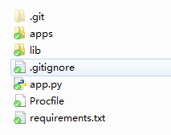
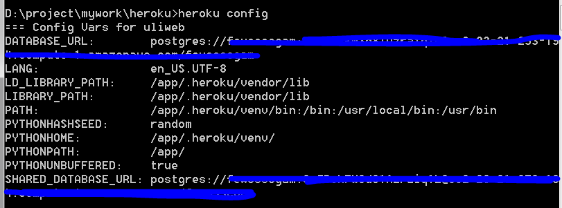

# Heroku 部署说明

Heroku本为提供Ruby云环境的平台，不过现在也支持 Python ，下面将描述如何在它上面
部署 Uliweb。此应用以 simple_todo 为例，可以从 `uliweb-doc/projects` 中得到。


## 客户端下载及登录

首先保证你已经有了 heroku 的帐号。然后去它的客户端页面下载合适的客户端，这里我
以windows客户端为例。下载并安装后，首先执行:


```
heroku login
```

根据提示输入你的邮箱和密码，然后它会自动查找本地的ssh公钥，如果找到，则会问你是
否要上传。因为我以前已经安装过 git 所以已经生成过公钥。


## 创建项目

首先在本地创建一个目录作为你的项目目录，如: heroku。进入这个目录，然后执行:


```
heroku create --stack cedar
```

执行如图:


我们可以从结果中看到已经生成了可访问的URL和git仓库地址。在后面我们可以改个名。
不过我试了，如果还没有上传过代码，好象改不了。

文本没有使用virtualenv来创建 Python 环境，所以省略了这块的处理。


## 编写代码

首先保证你的uliweb的版本在 0.1.1 以上，因为从 0.1.1 才支持 heroku 。在项目目录
下执行:


```
uliweb support heroku
```

这样会在当前目录下生成:


```
lib/
.gitignore
app.py
Procfile
requirements.txt
```

其中:


lib/ --
    用来存放你想上传的一些库。不过在一般情况下，你可以通过 requirements.txt
    来安装，因此不一定需要。不过在 app.py 中会将 lib 目录添加到 sys.path 中。

.gitignore --
    因为 heroku 使用的是 git 上传版本，所以这里提供了一个简单的 .gitignore 文件，
    你可以根据需要进行修改。

app.py --
    启动文件。它会自动识别 `os.environ['PORT']` 如果没有缺省使用 5000 端口，
    同时将 IP 绑定到 `0.0.0.0` 上。

Procfile --
    Heroku 会采用 foreman 来启动应用，你可以在本地用它来启动 uliweb 项目。访问
    地址可以是 `http://localhost:5000`

    
    因为我更熟悉nginx+uwsgi的模式，因此使用foreman的话不知道有没有性能问题。
    并且没有看到如何配置静态文件？所以在我的试验中能用开发服务器来提供服务和
    静态文件的支持。
    

requirements.txt --
    pip 安装需求文件，缺省要安装:

    ```
    Uliweb==0.1.1
    psycopg2==2.4.5
    SQLAlchemy==0.7.7
    ```

    因为 heroku 采用的是 postgreSql 数据库。


然后将 simple_todo (在uliweb-doc/projects/simple_todo下) 的代码拷贝到项目目录下。
注意，这里没有单独创建一个project的项目目录，而是直接使用项目目录。所以在这个目
录下应该直接有 apps 子目录。当前目录结构如:




因为 heroku 可以直接运行后端的命令，因此就可以直接运行 uliweb 的命令行工具，如
同步数据库。所以将项目目录直接做为uliweb项目是为了方便执行命令行。

接着修改 `apps/settings.ini` ，内容为:


```
[GLOBAL]
DEBUG = True

INSTALLED_APPS = [
    'uliweb.contrib.staticfiles',
    'uliweb.contrib.orm',
    'uliweb.contrib.heroku',
    'todo',
    ]

[SITE]
SITE_NAME = '任务跟踪'
EMAIL = 'limodou@gmail.com'
```

在Heroku是可以使用 Debug 调试的。上面在 `uliweb.contrib.orm` 后面安装了 `uliweb.contrib.heroku` 。
在 `uliweb.contrib.heroku` 中可以自动从 `os.environ` 中获得 `DATABASE_URL` 的信息。

上面的代码基本上写好了。然后我们直接上传。


## 上传代码

首先在本地创建GIT创建，把所有代码提交进去:


```
git init
git add .
git commit -m "message"
```

然后检查一下remote中是不是有heroku:


```
git remote
```

如果没有则将上面的git地址添加到remote中去:


```
git remote add heroku <heroku地址>
```

然后开始push代码:


```
git push heroku master
```

在push成功时，会根据相关的requirements.txt等信息开始后台的部署和服务启动。但是
此时很有可能数据库还未生效。前面已经说了，uliweb.contrib.heroku 会从环境变量中
获得数据库连接的串，而uliorm所使用的数据库连接和 heroku 提供的是一致的。这块都
已经由这个 app 处理了。现在的关键就是要创建数据库的实现。


## 创建数据库

可以先用:


```
heroku config
```

结果如图:




可以看到有 `DATABASE_URL` 的信息。如果没有，说明数据库实例没有创建，则可以执行:


```
heroku addons:add shared-database
```


## 应用改名

前面说了，如果觉得自建的应用名不好看，可以修改一下，使用:


```
heroku rename <你想改的名字>
```

一旦名字修改了，你的服务URL和git的地址都将发生变化。不过服务地址会自动变化，所以
不用做什么特殊处理。


## 数据库表的同步

代码传完了，名字也改了，数据库也建了，但是访问 simple_todo 还是有问题，因为这个
例子需要创建一个 todo 的表。heroku没有提供phpadmin，不过它可以在本地执行远端的
命令，所以很方便，下面执行:


```
heroku run uliweb syncdb
```

这里你会看到 todo 表被创建的信息。这样就可以访问你的应用了。我的例子是 [http://uliweb.herokuapp.com/](http://uliweb.herokuapp.com/)


## 调试

在heroku上可以直接查看出错页面，所以还是挺方便。同时如果想看日志，可以执行:


```
heroku logs
```


## 参考

参考原 Heroku 的文档有些问题并不能解决，有些是通过这篇文档来解决的。

[部署Python网站到Heroku云平台](http://www.tylerlong.me/1336566394/)

